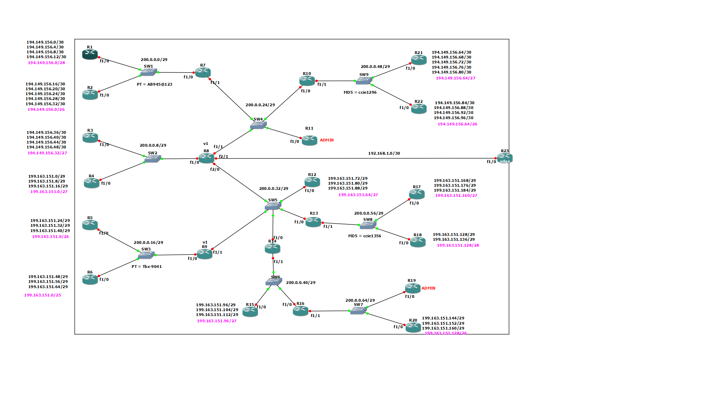

# Enterprise RIP lab demonstrating RIP v1/v2 interoperability, MD5 authentication, route summarization, passive interfaces, unicast updates, and default route injection using Cisco IOSv in GNS3.

## 📘 Overview

This lab demonstrates advanced dynamic routing concepts using RIP Version 1 and RIP Version 2, focusing on interoperability, route summarization, authentication, route control, and default route injection.

The network was built and tested using **GNS3**, simulating a multi-router enterprise environment connected to an ISP for external network reachability.

---

## 🎯 Objectives

The main objectives of this lab were to:

* Implement RIP Version 1 and RIP Version 2 across multiple routers.
* Configure interoperability between RIP v1 and RIP v2 domains.
* Apply route summarization on loopback interfaces to reduce routing table size and improve scalability.
* Secure routing updates using MD5 authentication between RIP neighbors.
* Configure passive interfaces to prevent unnecessary routing updates while maintaining network reachability.
* Inject a default route from the Edge Router into the internal routing domain.
* Ensure only designated Admin Routers receive complete routing information.
* Implement unicast RIP updates to control routing advertisements and reduce unnecessary broadcasts.

---

## 🧩 Network Topology

### Topology Components

* ISP Router providing external connectivity simulation.
* Edge Router responsible for default route propagation.
* Multiple routers organized into RIP v1 and RIP v2 routing domains.
* Admin Routers configured to receive complete routing information.
* Layer 2 switches interconnecting routers across shared LAN segments.

### 📷 Topology



---

## 🧠 Key Concepts Demonstrated

### RIP Version Interoperability

* RIP Version 1 and RIP Version 2 coexistence.
* Routing information exchange between different RIP versions.
* Mixed-version enterprise routing deployment.

### Route Summarization

* Loopback networks summarized at distribution points.
* Reduced routing table entries.
* Improved routing scalability and update efficiency.

### Routing Authentication

* MD5 authentication configured between RIP neighbors.
* Prevention of unauthorized routing updates.
* Enhanced routing domain security.

### Passive Interfaces

* Routing updates suppressed on selected interfaces.
* Network advertisements maintained without neighbor formation.
* Reduced routing traffic and improved security.

### Default Route Injection

* Default route propagated from the Edge Router.
* Centralized external network access.
* Simplified internal routing tables.

### Unicast Routing Updates

* RIP updates sent directly to specific neighbors.
* Controlled route propagation.
* Reduced unnecessary update traffic.

### Administrative Route Control

* Full routing visibility provided only to designated Admin Routers.
* Controlled route distribution across the topology.

---

## ⚙️ Tools & Environment

| Component         | Technology        |
| ----------------- | ----------------- |
| Network Simulator | GNS3       |
| Routers           | Cisco IOSv        |
| End Hosts         | VPCS              |
| Switching         | Ethernet Switches |
| Routing Protocol  | RIP v1 / RIP v2   |

---

## 🔍 Verification & Testing

### Routing Table Verification

```bash
show ip route
```

### RIP Configuration Verification

```bash
show ip protocols
```

### Authentication Verification

```bash
debug ip rip
show key chain
```

### Route Summarization Verification

```bash
show ip route
```

### Connectivity Testing

```bash
ping <destination>
traceroute <destination>
```

### Default Route Verification

```bash
show ip route 0.0.0.0
```

---

## 📈 Skills Demonstrated

* Dynamic Routing
* RIP Version 1 & Version 2
* Route Summarization
* MD5 Routing Authentication
* Routing Security
* Route Advertisement Control
* Passive Interface Configuration
* Default Route Injection
* Unicast Routing Updates
* Cisco IOS Configuration
* Network Verification & Troubleshooting
* Enterprise Network Design

---

## 🧾 Summary

This lab demonstrates enterprise-level routing concepts beyond basic connectivity, focusing on routing optimization, security, scalability, and administrative control.

The implementation showcases practical network engineering skills including route summarization, authentication, routing interoperability, passive interface deployment, unicast route propagation, and default route injection—concepts commonly encountered in production enterprise environments.

---

## 👤 Author

**Ahmad07**

Network Engineer


[LinkedIn](https://www.linkedin.com/in/bakhtiyark)


